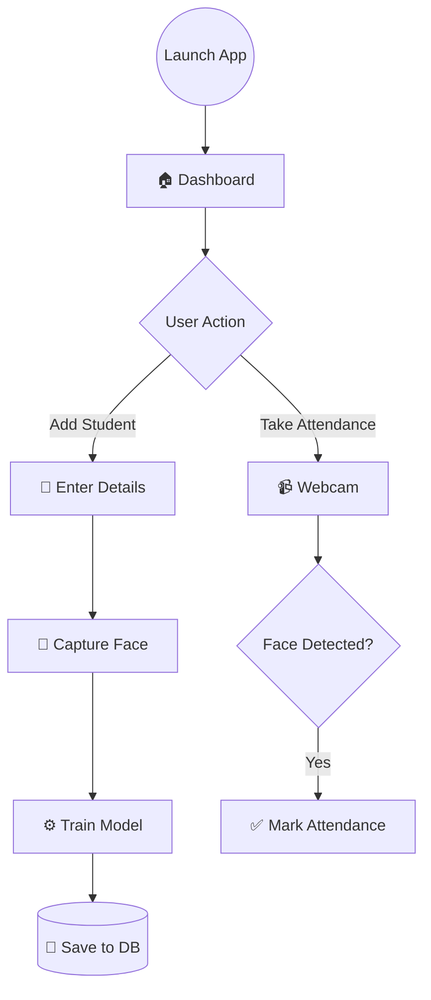

# AttendancePro v2.0 📸

<div align="center">


</div>

**AttendancePro** is a desktop application that uses **computer vision** to automate the attendance process.  
It scans faces through a webcam, verifies them against a registered student database, and logs attendance automatically — **completely hands-free**.

I originally built **AttendancePro v1.0** during my **12th grade (Commerce + Computer Science)**.  
Now, **v2.0** is a complete rewrite with a modern dark-themed UI, visual analytics, and a clean, modular architecture.

---

## 📸 Interface Preview

### 📊 Dashboard
The central hub of the application showing quick analytics and attendance statistics.


---

### 👥 Student Management
Easily manage classes and register new students into the system.

| Class Management | Add New Student |
|:---:|:---:|
|  |  |

---

### 🤖 Face Recognition in Action
Real-time face data collection and attendance marking.

| Recording Face Data | Taking Attendance |
|:---:|:---:|
|  |  |

---

## 👨‍💻 The Story Behind This Project

> *"My goal is to become an AI/ML Engineer.  
> My strength lies in Computer Science and understanding the logic behind the magic."*

I started my academic journey in the **Commerce stream**, but my interest in logic, programming, and automation gradually pulled me into the world of technology.

I spent nearly **6 months** building this project from scratch to deeply understand how **OpenCV**, **machine learning concepts**, and **databases** interact in real-world applications.  
AttendancePro became my personal playground for learning Python and AI fundamentals, and it now forms a strong base for my journey in **Integrated MSc (AI/ML)**.

---

## 🧩 The Logic Behind the Magic



---

## 🚀 What's New in v2.0

The second version focuses on transforming a learning project into a **professional desktop application**.

- 🎨 **Modern User Interface** — Built using CustomTkinter with dark mode support  
- 📊 **Visual Analytics** — Attendance trends displayed using Matplotlib graphs  
- 🗄️ **Zero-Setup Database** — SQLite eliminates the need for external database installation  
- 🧩 **Modular Architecture** — Clean separation between UI, logic, and database layers  
- 🔊 **Voice Feedback** — Spoken confirmation when attendance is successfully marked  

---

## 📂 Project Structure

```
AttendancePro/
├── face_dataset/        # Stored face embeddings (NumPy arrays)
├── screenshots/         # Images used in README
├── backend.py           # Face recognition and ML logic
├── db_logic.py          # SQLite database operations
├── frontend.py          # CustomTkinter GUI
├── main.py              # Application entry point
├── haarcascade...xml    # OpenCV face detection model
└── requirements.txt     # Python dependencies
```

---

## 💡 Key Features

- 🎯 **Face Recognition System** using OpenCV (Haar Cascades + KNN)
- 🗣️ **Voice Feedback** using pyttsx3 for confirmation
- 📈 **Smart Dashboard** with live attendance statistics
- 📤 **CSV Export** for Excel / Google Sheets integration
- 🔐 **Duplicate Prevention** — Attendance is marked only once per day

---

## 🛠️ Tech Stack

- **Programming Language:** Python 3.x  
- **GUI Framework:** CustomTkinter  
- **Computer Vision:** OpenCV, NumPy  
- **Database:** SQLite  
- **Visualization:** Matplotlib  

---

## ⚡ How to Run the Project

### 1️⃣ Clone the repository
```bash
git clone https://github.com/abhishekwadhwani2007/AttendancePro.git
cd AttendancePro
```

### 2️⃣ Install dependencies
```bash
pip install -r requirements.txt
```

### 3️⃣ Run the application
```bash
python main.py
```

> **Note:** The database file (`attendance.db`) is automatically created on the first run.

---

<div align="center">

Made with ❤️ by **Abhishek Wadhwani**

</div>
