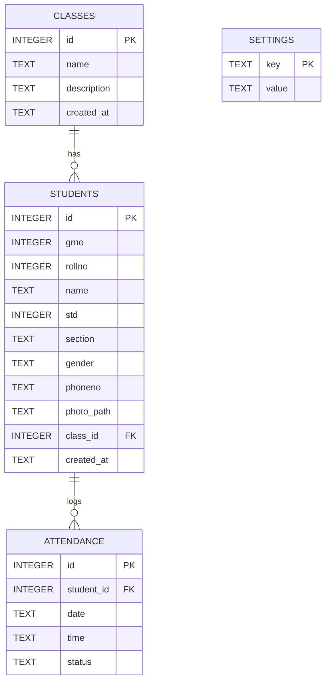
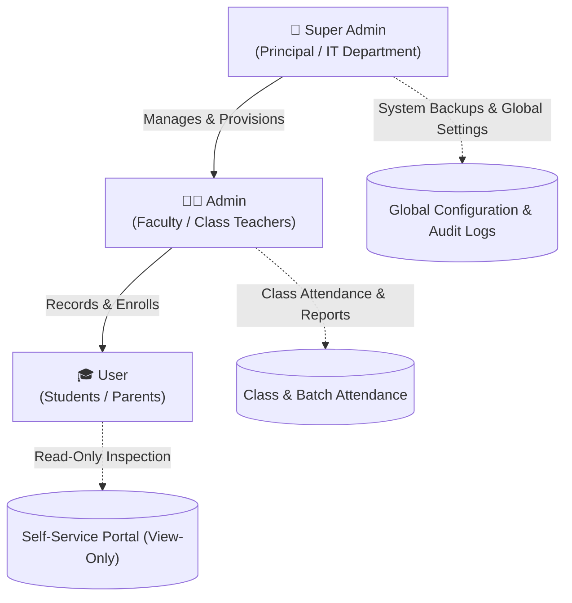

# AttendancePro

<p align="center">
  <a href="https://github.com/abhishekwadhwani2007/AttendancePro/releases/download/v2.5.0/AttendancePro_v2.5.exe">
    
  </a>
  <a href="https://github.com/abhishekwadhwani2007/AttendancePro/releases/tag/v2.5.0">
    
  </a>
</p>

> [!TIP]
> **Zero-Install One-Click Download**: You don't need Python or dependencies installed! Simply **[Download AttendancePro_v2.5.exe](https://github.com/abhishekwadhwani2007/AttendancePro/releases/download/v2.5.0/AttendancePro_v2.5.exe)** and double-click to run. All AI models, icons, and UI assets are fully bundled.

AttendancePro is a local desktop attendance management app built with Python, CustomTkinter, OpenCV, and SQLite. It helps schools or coaching classes register students, capture face data through a webcam, and mark daily attendance with face recognition.

The current app version is **v2.5**. It keeps the full workflow local: student records, attendance logs, app settings, and face samples stay on the user's machine. That makes the project easy to run for learning, demos, and small classroom setups without requiring a hosted backend or paid services.

## Interface Preview

### 1. Dashboard Overview
Central command center displaying total student counts, daily attendance metrics, and quick access shortcuts.


### 2. Student Records
Directory for browsing, searching, and managing registered students across all classes.


### 3. Face Recognition Attendance
Real-time webcam interface featuring automated face detection, instant matching, and audio confirmations.


### 4. Reports & Analytics
Filterable attendance logs with date ranges and one-click export to CSV for administrative record-keeping.


### 5. Classes Management
Academic batch organization to create and structure classes and sections.


### 6. Settings & Location
System configuration panel for camera selection, detection sensitivity, and campus location controls.


## What It Does

- Registers students with GR number, roll number, class, section, gender, and phone number
- Captures webcam face samples and stores them locally as NumPy data
- Recognizes registered faces with OpenCV face detection and KNN matching
- Marks daily attendance while preventing duplicate attendance for the same student and date
- Shows dashboard metrics for total students, present students, classes, and daily records
- Displays a weekly attendance trend chart
- Provides attendance reports with date range and student-name filters
- Exports report data to CSV for spreadsheet workflows
- Manages class batches directly from the desktop UI
- Gives local voice feedback through `pyttsx3`

## Tech Stack

- Python 3.8+
- CustomTkinter
- OpenCV
- NumPy
- SQLite
- Matplotlib
- SciPy
- Pillow
- pyttsx3
- packaging

## Project Structure

```text
AttendancePro/
├── screenshots/                 # README images
├── backend.py                   # Face capture, recognition, config, and utility logic
├── db_logic.py                  # SQLite schema and database operations
├── frontend.py                  # CustomTkinter desktop UI
├── main.py                      # Application entry point
├── requirements.txt             # Python dependencies
└── README.md
```

Runtime files are created locally and should not be committed:

- `attendance.db`
- `attendance.db-*`
- `config.json`
- `.env`
- `face_dataset/`
- `haarcascade_frontalface_default.xml`
- build output such as `build/` and `dist/`

## Database Overview

AttendancePro creates and updates its SQLite database automatically on launch.


```mermaid
erDiagram
    CLASSES ||--o{ STUDENTS : has
    STUDENTS ||--o{ ATTENDANCE : logs

    CLASSES {
        INTEGER id PK
        TEXT name
        TEXT description
        TEXT created_at
    }

    STUDENTS {
        INTEGER id PK
        INTEGER grno
        INTEGER rollno
        TEXT name
        INTEGER std
        TEXT section
        TEXT gender
        TEXT phoneno
        TEXT photo_path
        INTEGER class_id FK
        TEXT created_at
    }

    ATTENDANCE {
        INTEGER id PK
        INTEGER student_id FK
        TEXT date
        TEXT time
        TEXT status
    }

    SETTINGS {
        TEXT key PK
        TEXT value
    }
```

## Automatic Face Detection Model

The app uses OpenCV's Haar Cascade model for face detection. If `haarcascade_frontalface_default.xml` is missing, AttendancePro downloads it automatically on startup and stores it in the project/runtime folder.

This file is intentionally ignored by Git because it is a generated runtime dependency. A fresh clone can still run normally as long as the machine has internet access the first time the app starts. If the automatic download fails, manually download `haarcascade_frontalface_default.xml` from OpenCV's Haar Cascade data and place it beside `main.py`.

## Setup

1. Clone the repository.

```bash
git clone https://github.com/abhishekwadhwani2007/AttendancePro.git
cd AttendancePro
```

2. Create and activate a virtual environment.

```bash
python -m venv venv
venv\Scripts\activate
```

3. Install dependencies.

```bash
pip install -r requirements.txt
```

4. Run the application.

```bash
python main.py
```

On first launch, the app creates the SQLite database, prepares the local face dataset folder, and downloads the Haar Cascade file if it is not already available.

## How The Workflow Feels

Start by creating class batches, then add students to those classes. When a student is added, the app opens the webcam and records face samples. Later, the attendance screen opens a recognition window where registered faces can be marked present for the current date.

Reports can be generated by date range and filtered by student name. Exported CSV files can be opened in Excel, Google Sheets, or any spreadsheet tool.

## Security And Privacy

AttendancePro is designed as a local-first desktop app. It does not require API keys, cloud accounts, passwords, or external databases for the current version.

Because the project handles student data and face samples, keep local runtime files private and out of version control. Review `.gitignore` before publishing or packaging the app.

## Upcoming Update: Role-Based Access Control (RBAC) & Institutional Hierarchy

To support structured academic administration across schools, colleges, and coaching institutions, the upcoming update introduces a comprehensive 3-tier Role-Based Access Control (RBAC) system:


```mermaid
graph TD
    SuperAdmin["👑 Super Admin\n(Principal / IT Department)"] -->|Manages & Provisions| Admin["🧑‍🏫 Admin\n(Faculty / Class Teachers)"]
    Admin -->|Records & Enrolls| User["🎓 User\n(Students / Parents)"]
    SuperAdmin -.->|System Backups & Global Settings| GlobalConfig[("Global Configuration & Audit Logs")]
    Admin -.->|Class Attendance & Reports| ClassData[("Class & Batch Attendance")]
    User -.->|Read-Only Inspection| StudentPortal[("Self-Service Portal (View-Only)")]
```

### 1. Super Admin (Principal / Computer & IT Department)
* **Full Institutional Governance**: Central authority over global configurations, camera hardware calibration, database migrations, and disaster-recovery backups.
* **Faculty & Role Provisioning**: Creates faculty credentials, assigns teachers to designated grade levels/sections, and manages institutional academic terms.
* **Institution-Wide Auditing**: Access to comprehensive audit logs, cross-class attendance trends, anomaly detection (e.g. repeated unexcused absences), and master administrative overrides.

### 2. Admin (Teachers / Faculty)
* **Classroom Attendance Operations**: Initiates webcam facial recognition sessions for assigned class batches and manages instant present/absent tagging.
* **Student Onboarding**: Captures and validates multi-angle webcam face samples for new student registrations.
* **Scoped Class Analytics**: Generates, inspects, and exports date-range attendance summaries (CSV/PDF) strictly for the classes and sections under their charge, preventing cross-classroom interference.

### 3. User (Students / Parents)
* **Transparent Self-Service Portal**: Allows students and parents to review personal daily attendance history, aggregate monthly percentages, and monitor minimum attendance thresholds (e.g. 75% examination eligibility).
* **Guaranteed Tamper-Proof Read-Only Access**: Strict read-only permissions prevent students from modifying logs, deleting records, or tampering with database entries. This guarantees complete record integrity, accountability, and institutional trust.

---

## Long-Term Technical Roadmap (Modern Architecture)

AttendancePro is evolving from a local desktop utility into a scalable, high-performance edge attendance ecosystem. The technical roadmap focuses on five core engineering pillars:

### 1. Advanced Deep Learning & Liveness Detection
* **State-of-the-Art Embedding Models**: Transitioning from OpenCV Haar cascades + k-NN to lightweight deep face recognition embeddings (e.g., InsightFace / MobileFaceNet / FaceNet) for significantly higher precision under varying classroom lighting and angles.
* **Anti-Spoofing & Liveness Verification**: Incorporating optical flow, blink detection, and 3D texture analysis to prevent spoofing attempts via printed photographs or smartphone screens.

### 2. Edge-to-Cloud Hybrid Data Synchronization
* **Local-First Reliability with Edge Sync**: Preserving fast, offline-capable SQLite operations locally at the edge, while introducing asynchronous background sync to cloud PostgreSQL / Supabase backends.
* **Multi-Terminal Fleet Synchronization**: Enabling multiple classroom gates, labs, and attendance terminals across a campus to seamlessly aggregate into a unified central database.

### 3. Decoupled Service Architecture & Cross-Platform UI
* **FastAPI Microservices Core**: Decoupling recognition inference and database logic behind high-throughput, async REST/WebSocket APIs.
* **Multi-Platform Client Fleet**: Supporting responsive web dashboards for administrators and lightweight mobile/tablet kiosks for classroom doors and student check-ins.

### 4. Automated Communication & Notification Gateways
* **Real-Time Absence Alerts**: Automated dispatch of instant notifications via WhatsApp Business API, SMS, and SMTP email to parents whenever a student is marked absent or arrives late.
* **Weekly Automated Summaries**: Periodic attendance digest delivery for academic counselors and parents.

### 5. Automated CI/CD & Automated Code Signing
* **GitHub Actions Pipeline**: Automated multi-platform build testing, matrix dependency checks, and PyInstaller artifact builds on every release tag.
* **Cryptographic Verification**: Automated SHA-256 checksum generation and Windows Authenticode binary signing for safe, warning-free downloads.
