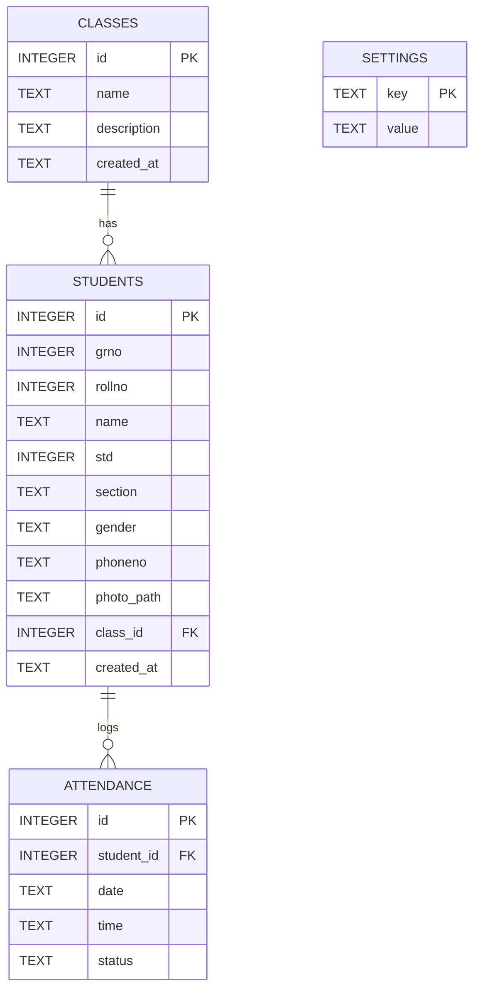

# AttendancePro

AttendancePro is a local desktop attendance management app built with Python, CustomTkinter, OpenCV, and SQLite. It helps schools or coaching classes register students, capture face data through a webcam, and mark daily attendance with face recognition.

The current app version is **v2.5**. It keeps the full workflow local: student records, attendance logs, app settings, and face samples stay on the user's machine. That makes the project easy to run for learning, demos, and small classroom setups without requiring a hosted backend or paid services.

## Interface Preview

### 1. Dashboard Overview
Central command center displaying total student counts, daily attendance metrics, and quick access shortcuts.


### 2. Student Records
Directory for browsing, searching, and managing registered students across all classes.


### 3. Face Recognition Attendance
Real-time webcam interface featuring automated face detection, instant matching, and audio confirmations.


### 4. Reports & Analytics
Filterable attendance logs with date ranges and one-click export to CSV for administrative record-keeping.


### 5. Classes Management
Academic batch organization to create and structure classes and sections.


### 6. Settings & Location
System configuration panel for camera selection, detection sensitivity, and campus location controls.


## What It Does

- Registers students with GR number, roll number, class, section, gender, and phone number
- Captures webcam face samples and stores them locally as NumPy data
- Recognizes registered faces with OpenCV face detection and KNN matching
- Marks daily attendance while preventing duplicate attendance for the same student and date
- Shows dashboard metrics for total students, present students, classes, and daily records
- Displays a weekly attendance trend chart
- Provides attendance reports with date range and student-name filters
- Exports report data to CSV for spreadsheet workflows
- Manages class batches directly from the desktop UI
- Gives local voice feedback through `pyttsx3`

## Tech Stack

- Python 3.8+
- CustomTkinter
- OpenCV
- NumPy
- SQLite
- Matplotlib
- SciPy
- Pillow
- pyttsx3
- packaging

## Project Structure

```text
AttendancePro/
├── screenshots/                 # README images
├── backend.py                   # Face capture, recognition, config, and utility logic
├── db_logic.py                  # SQLite schema and database operations
├── frontend.py                  # CustomTkinter desktop UI
├── main.py                      # Application entry point
├── requirements.txt             # Python dependencies
└── README.md
```

Runtime files are created locally and should not be committed:

- `attendance.db`
- `attendance.db-*`
- `config.json`
- `.env`
- `face_dataset/`
- `haarcascade_frontalface_default.xml`
- build output such as `build/` and `dist/`

## Database Overview

AttendancePro creates and updates its SQLite database automatically on launch.


```mermaid
erDiagram
    CLASSES ||--o{ STUDENTS : has
    STUDENTS ||--o{ ATTENDANCE : logs

    CLASSES {
        INTEGER id PK
        TEXT name
        TEXT description
        TEXT created_at
    }

    STUDENTS {
        INTEGER id PK
        INTEGER grno
        INTEGER rollno
        TEXT name
        INTEGER std
        TEXT section
        TEXT gender
        TEXT phoneno
        TEXT photo_path
        INTEGER class_id FK
        TEXT created_at
    }

    ATTENDANCE {
        INTEGER id PK
        INTEGER student_id FK
        TEXT date
        TEXT time
        TEXT status
    }

    SETTINGS {
        TEXT key PK
        TEXT value
    }
```

## Automatic Face Detection Model

The app uses OpenCV's Haar Cascade model for face detection. If `haarcascade_frontalface_default.xml` is missing, AttendancePro downloads it automatically on startup and stores it in the project/runtime folder.

This file is intentionally ignored by Git because it is a generated runtime dependency. A fresh clone can still run normally as long as the machine has internet access the first time the app starts. If the automatic download fails, manually download `haarcascade_frontalface_default.xml` from OpenCV's Haar Cascade data and place it beside `main.py`.

## Setup

1. Clone the repository.

```bash
git clone https://github.com/abhishekwadhwani2007/AttendancePro.git
cd AttendancePro
```

2. Create and activate a virtual environment.

```bash
python -m venv venv
venv\Scripts\activate
```

3. Install dependencies.

```bash
pip install -r requirements.txt
```

4. Run the application.

```bash
python main.py
```

On first launch, the app creates the SQLite database, prepares the local face dataset folder, and downloads the Haar Cascade file if it is not already available.

## How The Workflow Feels

Start by creating class batches, then add students to those classes. When a student is added, the app opens the webcam and records face samples. Later, the attendance screen opens a recognition window where registered faces can be marked present for the current date.

Reports can be generated by date range and filtered by student name. Exported CSV files can be opened in Excel, Google Sheets, or any spreadsheet tool.

## Security And Privacy

AttendancePro is designed as a local-first desktop app. It does not require API keys, cloud accounts, passwords, or external databases for the current version.

Because the project handles student data and face samples, keep local runtime files private and out of version control. Review `.gitignore` before publishing or packaging the app.

## Roadmap

The next development phase will focus on making the app easier to test, package, and maintain while improving recognition reliability and UI responsiveness.

Planned directions include:

- Cleaner service boundaries between UI, database, and recognition logic
- Stronger form validation and clearer error states
- Better model/data management for face recognition
- Automated tests for database and attendance workflows
- Packaged desktop releases with a smoother setup experience
- Optional architecture improvements for larger deployments
