# AttendancePro v2.0 📸

::: {align="center"}


:::

**AttendancePro** is a desktop application that uses computer vision to
automate attendance.\
It scans faces via a webcam, verifies them against a registered
database, and logs entries --- completely hands-free.

Originally built as **v1.0** during my 12th grade (Commerce + CS),
**v2.0** is a complete rewrite featuring a modern dark-mode UI, visual
analytics, and a modular architecture.

------------------------------------------------------------------------

## 📸 Interface Preview

### 📊 Dashboard

The central hub for analytics and quick statistics.


------------------------------------------------------------------------

### 👥 Student Management

  -------------------------------------------------------------------------------------------
                  Class Management                               Add New Student
  ------------------------------------------------- -----------------------------------------
                          Student](screenshots/add%20student.png)

  -------------------------------------------------------------------------------------------

------------------------------------------------------------------------

### 🤖 Face Recognition in Action

  ---------------------------------------------------------------------------------------------------
                Recording Face Data                                Taking Attendance
  ------------------------------------------------ --------------------------------------------------
                       Attendance](screenshots/taking%20attendance.png)

  ---------------------------------------------------------------------------------------------------

------------------------------------------------------------------------

## 👨‍💻 The Story Behind This

> *"My goal is to become an AI/ML Engineer.\
> My strength is Computer Science and understanding the logic behind the
> magic."*

I started my academic journey in the **Commerce stream**, but my
curiosity for logic and algorithms pulled me into computer science.

------------------------------------------------------------------------

## 🧩 The Logic Behind the Magic

``` mermaid
graph TD
    Start((Launch App)) --> Dash[🏠 Dashboard]
    Dash --> Nav{User Action}
    Nav -- Add Student --> Form[📝 Enter Details]
    Form --> Cam1[📸 Capture Face]
    Store --> Save[(💾 Save to DB)]
    Nav -- Take Attendance --> Cam2[📹 Webcam]
    Cam2 --> Detect{Face Detected?}
    Detect -- Yes --> Log[✅ Mark Attendance]
```



------------------------------------------------------------------------

## 🚀 What's New in v2.0

-   Modern UI with CustomTkinter\
-   Visual analytics using Matplotlib\
-   SQLite database (no setup required)\
-   Modular and clean codebase

------------------------------------------------------------------------

## ⚡ How to Run

``` bash
git clone https://github.com/abhishekwadhwani2007/AttendancePro.git
cd AttendancePro
pip install -r requirements.txt
python main.py
```

------------------------------------------------------------------------

::: {align="center"}
Made with ❤️ by **Abhishek Wadhwani**
:::
